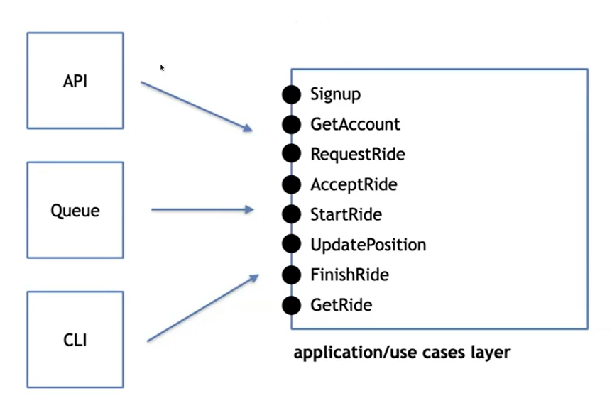
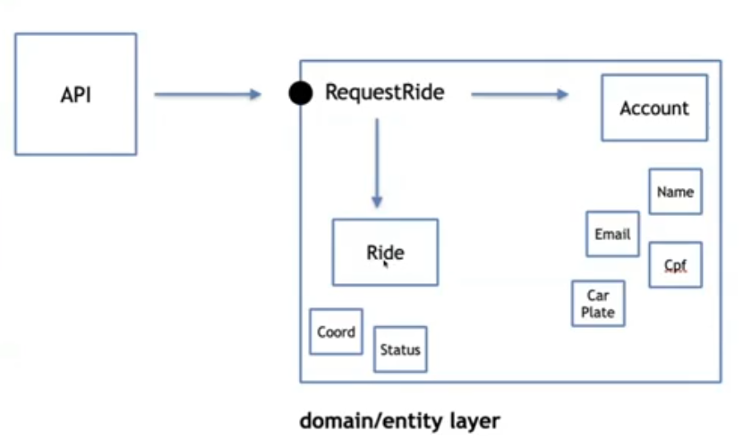

# Objetivo
A Clean Architecture é um modelo que tem como objetivo o `desacoplamento entre as regras de negócio, ou domínio, da aplicação e os recursos externos como frameworks e banco de dados`.

Permitir o desenvolvimento da aplicação isolada de runtime devices (file system, database, framework)

O centro da aplicação não são as tecnologias que serão usadas, e sim os casos de uso (o motivo pelo qual o usuário vai usar).

# Clean Achitecture

## Camadas
 - Entreprise Business Rules
 - Application Business Rules
 - Interface Adapters
 - Frameworks & Drivers

> Da camada mais interna da aplicação e isolada, da mais externa

### Dependency Rule
Quem está dentro da camada não conhece quem está fora, e quem está fora depende de quem está na camada abaixo

## Use Case

Os use cases `expõe o comportamento demandado pelos drivers (atores)`, e <u>orquestram as entidades e os recursos externos como banco de dados , APIs, Filas</u>.

> Lista de `use cases` que estão expostos e cada cliente consome o que quer.

--- 

### CRUD x `Use Case`
Uma coisa não tem exatamente relação com a outra. Dependedo do problema que está tentando resolver, não tem uma operação de CRUD explícita. 

> A confusão também acontece a partir da `API RESTful`. Este modelo não obriga a ter exatamente um crud para cada um dos recursos. Na verdade, não é nada disso que a `especificação` do modelo fala.

O `use case` é mais uma especialidade de cada umas das operações envolvendo CRUD. Podemos ter uma série de regras para executar uma atualização de dados de um produto. Podemos ter algumas formas de atualização de pequenos dados de um mesmo produto. Assim como os outros `use cases`. 

## Entity
Entidades são responsáveis por abstrair as `Regras de Negócio Independentes`, que <u>podem ser desde um objeto com métodos até mesmo um conjunto de funções</u>.

Na imagem temos o acesso da API ao `Use Case`, que neste caso, é o `Request Ride`. Este, ele pode, e vai, ser capaz de orquestrar e interagir com várias entidades, como: `Account` e `Ride`. E é possível também termos várias outras entidades menores que são usadas por essas entidades maiores.

Account
 - Name
 - Email
 - Cpf
 - Car Plate

Ride
 - Coordenates
 - Status

Este é um exemplo de esquema onde temos algumas entidades maiores (`Account` e `Ride`) interagindo e orquestrando outras entidades menores.

> IMPORTANTE: Entidade no contexto de `DDD` tem um significado específico, sendo tratado mais como abstração de lógicas que podem ser usadas em vários casos de uso. Já no `ORM` é mais relacionado ao mapeamendo entre as tabelas de banco de dados e os dados de aplicação.

### Objeto anêmico
O `objeto anêmico` é um antipadrão onde as entidades não possuem comportamento, elas apenas possuiem dados, ou chamadas explícitas para outras regras, sem o encapsulamento de regras de negócio.

#### Encapsulamento
consiste na proteção, ou "esconder" certos comportamentos, para que outros recursos estejam disponíveis.

### DAO x Repository
DAO (Data Access Object) é um padrão de projeto que tem como objetivo abstratir o acesso a dados, e é mais relacionado a persistência de dados. Já o Repository é um padrão de projeto que tem como objetivo abstrair o acesso a dados, mas é mais relacionado a regras de negócio.

A ideia do repository é trabalhar com entidade, e não com dados, como o DAO. O repository é mais relacionado a regras de negócio, enquanto o DAO é mais relacionado a persistência de dados.

### Interface Adapter
E a ponte que ponte que conecta a aplicação com o mundo exterior. Ele garante que a inferface externa seja respeitada e que a aplicação não dependa de detalhes de implementação de frameworks, banco de dados, etc.

---
> Por fim, os frameworks and drivers são o *nível mais baixo de abstração*, <u>é a interação com a tecnologia, com os componentes que realizam a conexão com o banco de dados, as requisições HTTP, a interação com o sistema de arquivos ou o acesso aos recursos do sistema operacional</u>.

---

## Camadas
Camadas são separações lógicas de contexto e responsabilidade. Camadas e pastas são coisas completamente diferentes.

### Inicialização da Aplicação
O <i>main</i>  é o <u>ponto de entrada </u> da aplicação (HTTP, CLI, UI, Testes), é l´aque as fábricas e estratégias são inicializadas e as injeções de dependência são realizadas durante a inicialização.

Existe um padrão de projeto inclusive para a inicialização da aplicação chamado `Composition Root`. Quanto mais fraca é o acoplamento entre os recursos inicializados e camadas da aplicação, mais perto do root da aplicação eles devem estar. 

É neste contexto que vamos fazer todo o gráfico de inicialização da aplicação, onde um recurso depende fracamente de outro.

> As dependências devem ser resolvidas o mais próximo possível do entrypoint da aplicação.

