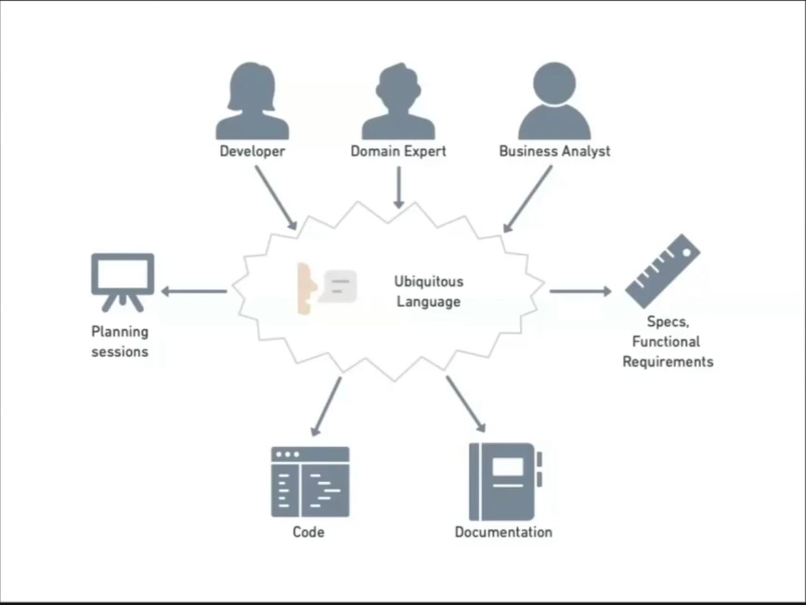
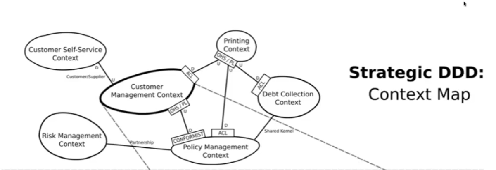
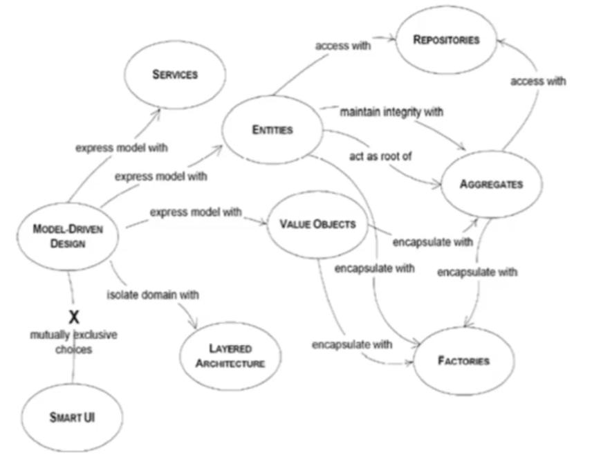

# Aula 04

## Domain-Driven Design - Parte 01

### O que é `Domínio`?
`O domínio é o problema, em termos de negócio,` que precisa ser resolvido <u>independente da tecnologia que será utilizada</u>.

> O domínio não tem relação apenas ao projeto em si, mas como a organização trabalha e enxerga o problema a ser resolvido como um todo.

#### Linguagem Ubíqua
É a tentativa de aproximar a linguagem de negócio com o dia a dia do desenvolvimento. A ideia é apresentar em tempo de desenvolvimento, conceitos e nomes que sejam utilizados pela área de negócio.

Alinhamento de linguagem entre os desenvolvedores e os especialistas de negócio, para que todos falem a mesma língua e não haja ruídos de comunicação.

> Este conceito tem muita relação e importância para comunicação entre os entes envolvidos no desenvolvimento do software. Não é para ficar bonito no papel, mas para trazer clareza e entendimento entre todos os envolvidos.

### Separações principais e gerais do DDD

#### DDD Estratégico
Descoberta das áreas de conhecimento do negócio, assim como suas fronteiras e responsabilidades. Aqui a ideia é mapear e entender como o negócio funciona, e como ele se organiza para resolver os problemas que surgem.

Aqui temos uma visão geral, e aplicação estratégica do DDD, as subareas da empresa, e como cada uma delas se relaciona com a outra. 

Geralmente é a primeira coisa que se faz, para uma aplicação saudável do DDD seja no projeto, seja na organização como um todo no dia a dia.

#### DDD Tático
Aqui temos o foco na implementação e construção da camada de domínio e como ela se relaciona com outras camadas da aplicação ou com outras aplicações. Aqui o foco é a implementação do domínio, e como ele se relaciona com o restante da aplicação.

A **Modelagem Tática** é utilizada para construir a <u>camada de domínio</u>. 

A modelagem tática é a parte do DDD que se preocupa com a implementação do domínio, e como ele se relaciona com o restante da aplicação.

A nível tático, o `Clean Architecture` vai ser complementado com o DDD.

##### Objetos de Domínio
- Entities
- Value Objects
- Domain Services
- Aggregates
- Repositories*
- Factories

###### Value Objects <VO>
Também contém regras de negócio independentes, no entanto `são identificados pelo seu valor`, sendo imutáveis, ou seja, a <u>mudança implica na sua substituição</u>.

- Mede, quantifica ou descreve alguma coisa
- Seu valor é <u>imutável</u>
- É <u>substituído quando seu valor mudar</u>
- Pode ser <u>comparado pelo seu valor que representa</u>

**Exemplos**
- `Code`: Representa uma determnada regra de formação de um número
- `CPF`: Garante que o número do documento é válido
- `Dimension`: Abstrai a largura, altura, produndidade e peso de um item
- `Password`: Representa uma senha
- `Color`: Uma cor no formato RGB
- `Coord`: A latitude e longitude
- `Email`: Representa um email
- `Segment`: Representa duas posições geográficas no tempo

> A ideia do value object é que o objeto é focado e especializado em assegurar o estado do valor que ele representa. 

> `Obsessão Primitiva`: É um code smell, onde ao invés de usar o wrapper para encapsular operações referentes a um determinado valor, o desenvolvedor utiliza sempre tipos primitivos, para representação deixando a lógica de manipulação do valor espelhada e duplicada pelo código.

A identificação de possíveis candidatos para `Value Objects` seria olhar e substituir alguns tipos primitivos que estão pela aplicação "jogados".